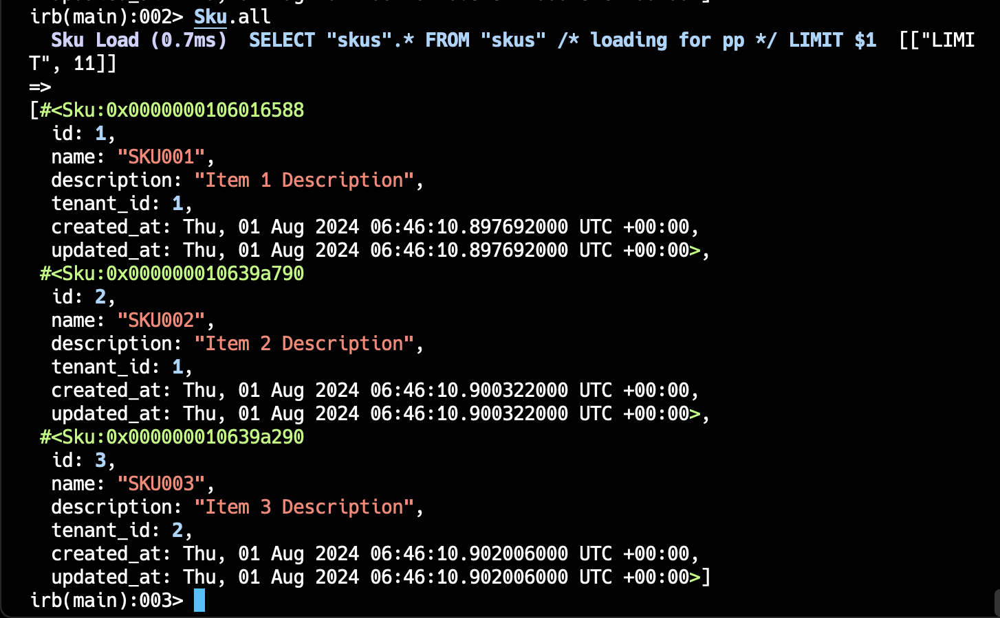
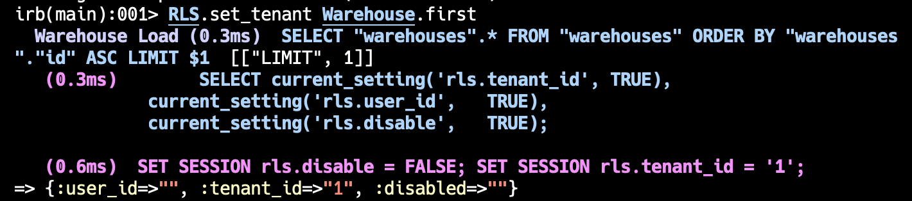
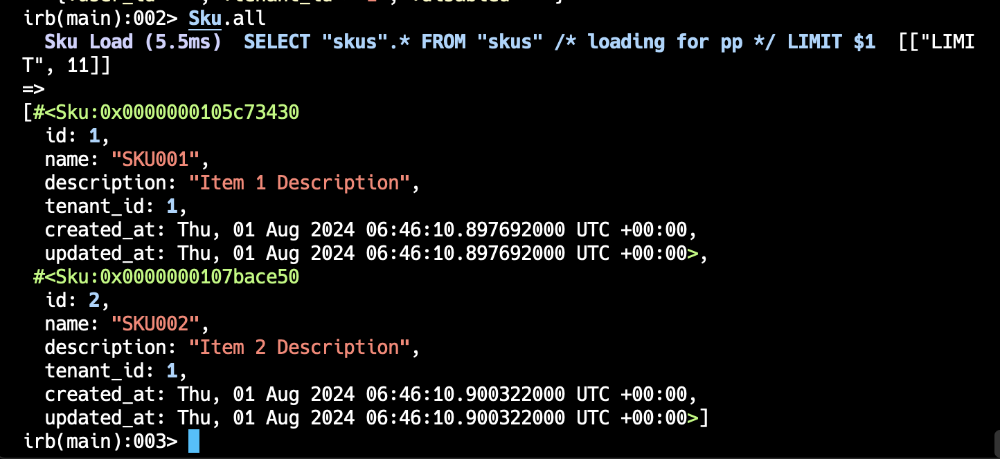

# README

## Rails App for Multitenancy with PostgreSQL Row Level Security

### Steps

1. **Create Resources with `tenant_id`**:
   - Add a `tenant_id` attribute to resources to store the ID of the selected warehouse.

2. **Install `rls_rails` Gem**:
   - Add the [rls_rails](https://github.com/suus-io/rls_rails) gem to your project.

3. **Generate RLS Migrations**:
   - Run `rails g rls_rails:install` to create a migration file containing two PostgreSQL User-Defined Functions (UDFs):
     - `current_tenant_id()`: Returns the current tenant ID.
     - `rls_disabled()`: Returns `TRUE` when RLS is disabled by `SET rls.disable TO TRUE`, otherwise `FALSE`.

4. **Set the Tenant in Application Controller**:
   - Set the tenant based on the request in the application controller, as demonstrated [here](https://github.com/SujayPrabhu96/rails_rls_for_multi_tenancy/commit/3941f5037941e23a8865fc724c3d83e055fbec57).

5. **Create Policies for Tables**:
   - Create policies for the tables in `db/policies/<table-name>/<table-name_version>`.

6. **Enable RLS and Apply Policies**:
   - Use migrations to enable RLS and apply the created policies to tables with methods like `enable_rls` and `create_policy`.

7. **Ensure Proper User Permissions**:
   - Ensure the user interacting with the database is not a superuser or does not have `BYPASS RLS` access.

### Note:
- By default, the owner of the table can bypass RLS. To enforce RLS for the table owner, use `enable_rls` with `force` set to `true`.

#### When the DB user is superuser

- Fetch all SKUs from rails console

#### When the user is not superuser or do not have BYPASS RLS access

- Set the tenant, if its not set

- Fetch all SKUs from rails console

- In actual Sku table has 3 entries. As the tenant_id is set to `1`, it is returning the SKUs only belonging to Warehouse 1